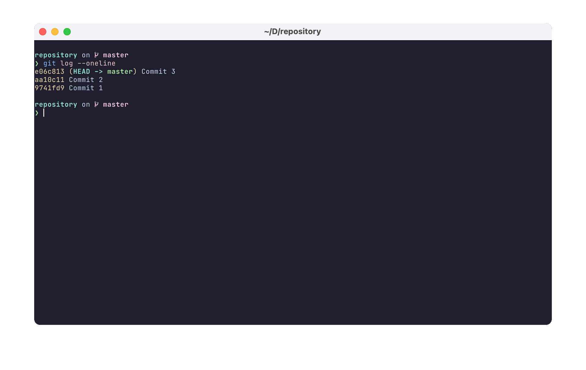
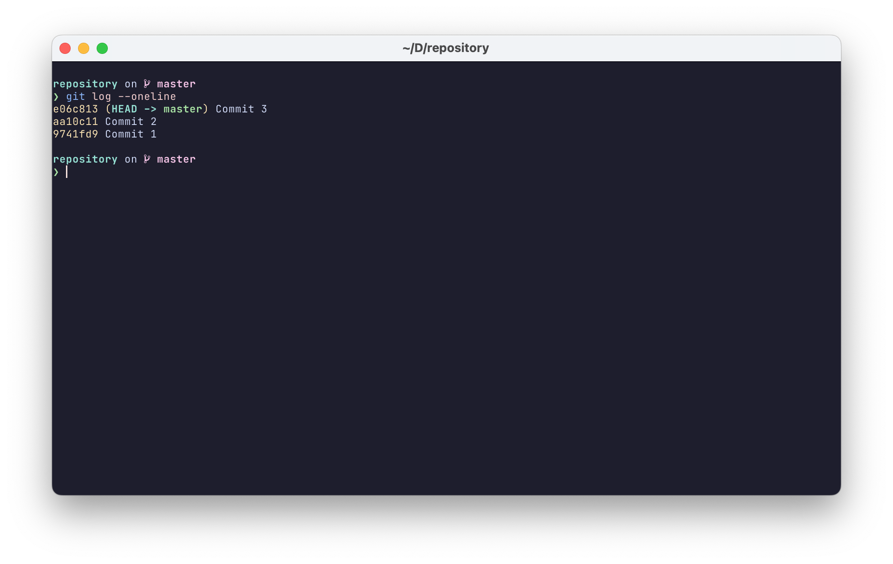
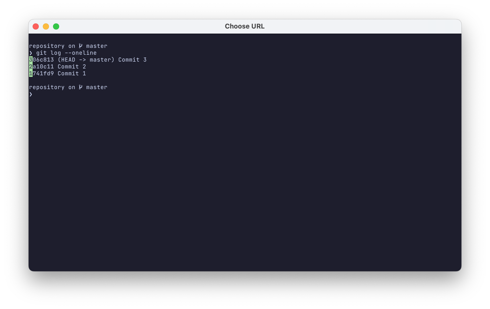
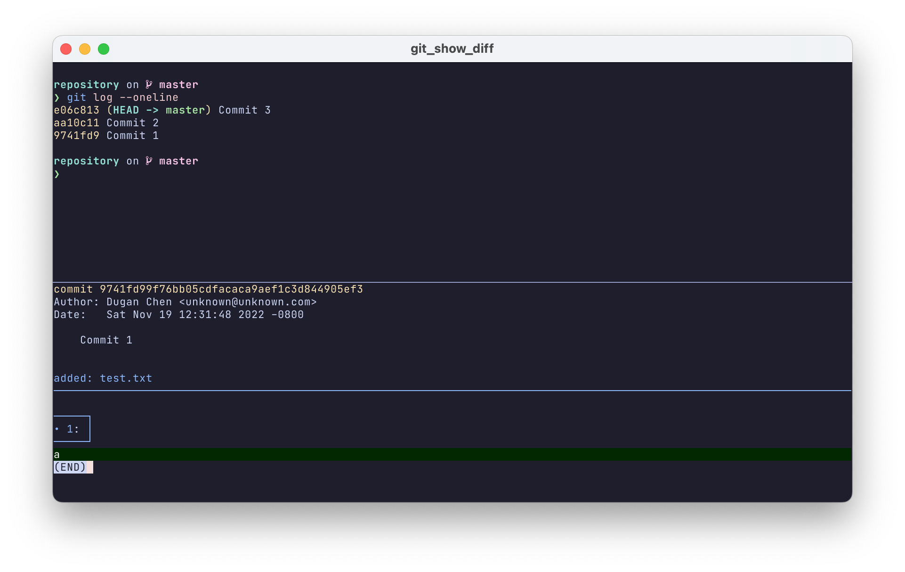

# Git commit browser for Kitty

This is a system for using [kitty](https://sw.kovidgoyal.net/kitty/) to browse
git commits, gitk style.

Put git-hash-hints.py in ~/.config/kitty

Put git_show_diff in your PATH.

Put the following in kitty.conf:

    map ctrl+shift+p>g kitten hints --customize-processing git-hash-hints.py

Display the git log in the terminal:

Press Ctrl+Shift+b and then g. You'll see a number next to each commit on the screen:

Enter one of the numbers to see that commit:

Press "q" to close the preview window.

As of now, it's at the "works on my computer" (OS X, with [Delta](https://github.com/dandavison/delta) as the git pager) stage.