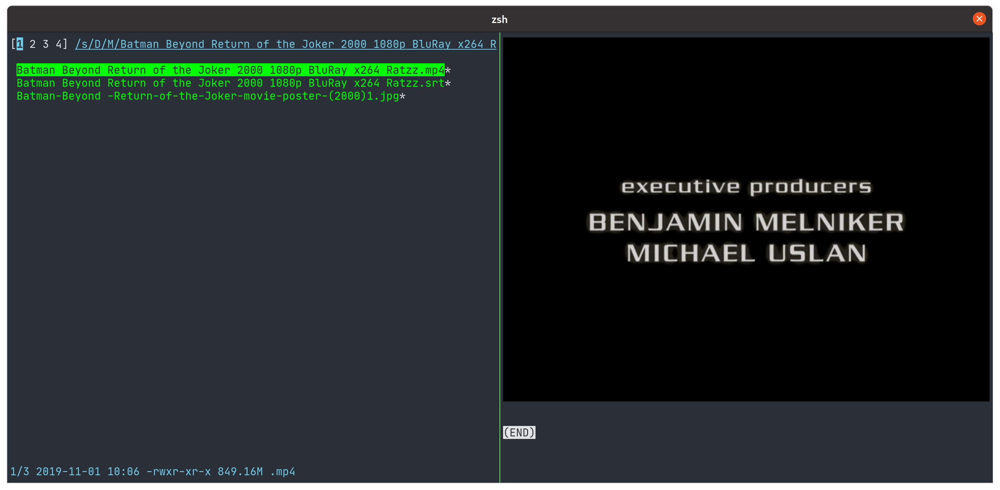

# kitty-pistol-previewer




A setup to get video thumbnails in [nnn](https://github.com/jarun/nnn) when it's running in [kitty](https://sw.kovidgoyal.net/kitty/).

Install nnn's "preview-tui" [plugin](https://github.com/jarun/nnn/tree/master/plugins#nnn-plugins).

Set kitty.conf up to support the previewer plugin:

```
allow_remote_control yes
```

Add the following to whatever script sets up your environment (.bashrc, .zshrc, etc):

```bash
export NNN_FIFO=/tmp/nnn.fifo
export NNN_PLUG='p:preview-tui'
export USE_PISTOL=1
alias nnn='nnn -Pp'
```

Install the (other) dependencies:

* [pistol](https://github.com/doronbehar/pistol)
* [jq](https://stedolan.github.io/jq/)
* [FFmpegthumbnailer](https://github.com/dirkvdb/ffmpegthumbnailer)

Set up your pistol.conf:

```
video/* kitty_vidthumb %pistol-filename%
application/vnd.rn-realmedia kitty_vidthumb %pistol-filename%
image/* kitty +kitten icat --silent --transfer-mode=stream --stdin=no %pistol-filename%
```

Copy the two scripts, "vidthumb" and "kitty_vidthumb", to your PATH and make them executable.

And that should be it.

The thumbnail cache and index are in ~/.cache/vidthumb.
