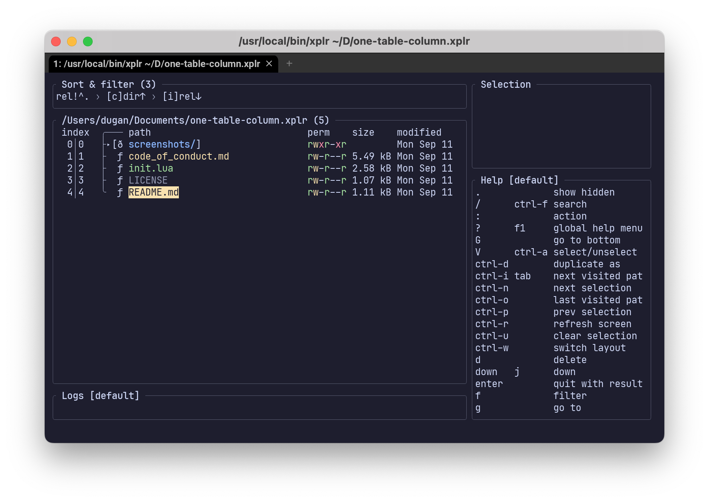
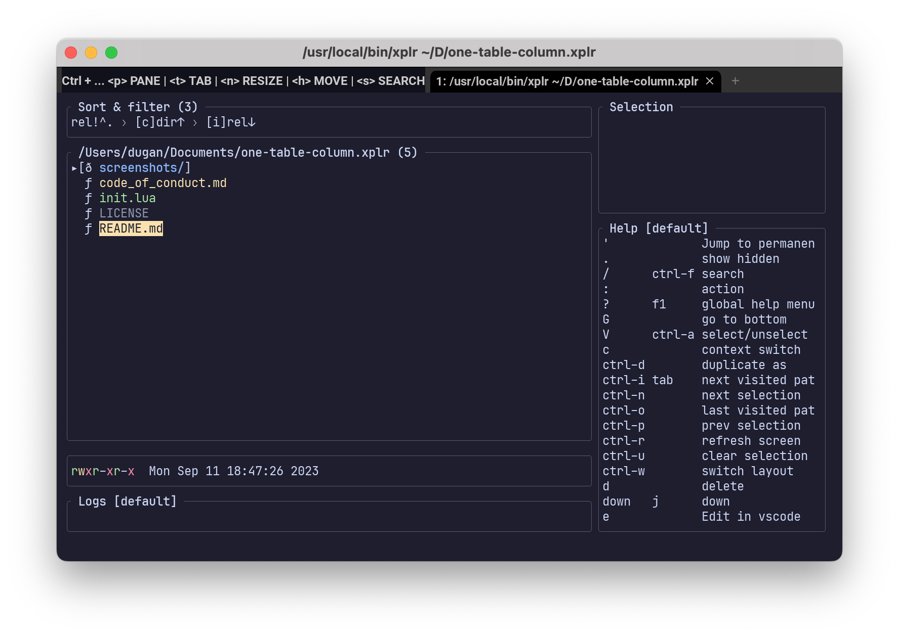

# XPLR Single Column Layout

## Installation

### Install manually

- Add the following line in `~/.config/xplr/init.lua`

  ```lua
  local home = os.getenv("HOME")
  package.path = home
    .. "/.config/xplr/plugins/?/init.lua;"
    .. home
    .. "/.config/xplr/plugins/?.lua;"
    .. package.path
  ```

- Clone the plugin

  ```bash
  mkdir -p ~/.config/xplr/plugins

  git clone https://github.com/duganchen/one-table-column.xplr ~/.config/xplr/plugins/one-table-column
  ```

- Require the module in `~/.config/xplr/init.lua`

  ```lua
  require("one-table-column").setup()
  ```

- Or, if you want the index.column:

  ```lua
  require("one-table-column").setup({ index = true })
  ```

## Features

This plugin gives you a single-column table. Each row now contains only the file path, and the information that used to be in the columns is now in a status area underneath.

You still have that information, and it's more efficient with horizontal space.

Running "setup" will update all four of XPLR's built-in layouts. If you want to use the status bar in your own layouts, it's "xplr.config.layouts.custom.Stats"

### Before


### After

